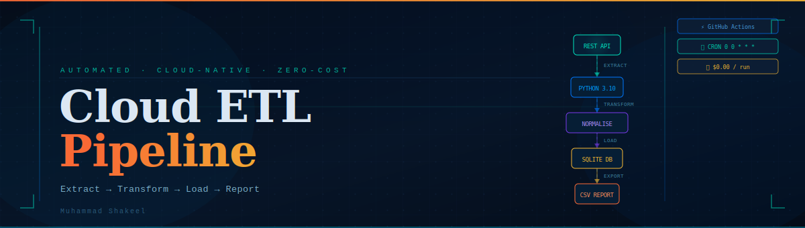
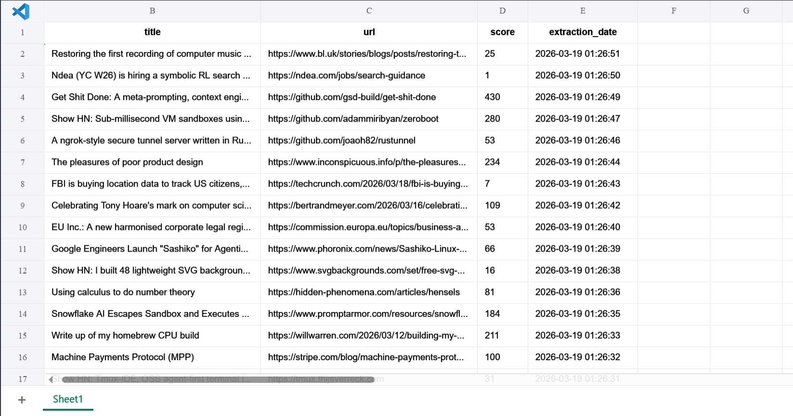

# Cloud-Automated ETL Pipeline


A production-style automation pipeline that extracts data from live APIs, transforms and loads it into a relational database, and exports structured CSV reports — all scheduled and executed autonomously on cloud runners via GitHub Actions.



---

## Table of Contents

- [Overview](#overview)
- [Architecture](#architecture)
- [Features](#features)
- [Tech Stack](#tech-stack)
- [Performance](#performance)
- [Sample Output](#sample-output)
- [Installation](#installation)
- [Usage](#usage)
- [Use Cases](#use-cases)
- [Roadmap](#roadmap)
- [License](#license)
- [Author](#author)

---

## Overview

Manual data extraction doesn't scale. Enterprise-grade intelligence requires autonomous pipelines that operate independently of local hardware and human intervention.

This project implements a fully automated **Extract → Transform → Load (ETL)** pipeline that:

- Connects to the **Hacker News REST API** on a daily schedule
- Ingests and normalises records into a **persistent SQLite database** using `UPSERT` logic for data integrity
- Automatically exports flat-file **CSV reports** and pushes them back to the repository
- Runs entirely on **ephemeral GitHub Actions cloud runners** — zero local infrastructure required

---

## Architecture

```
┌─────────────────────────┐
│   Hacker News REST API  │  ← Data Source
└────────────┬────────────┘
             │ Extract
             ▼
┌─────────────────────────┐
│   Python Requests       │  ← HTTP Client
└────────────┬────────────┘
             │ Transform / Clean
             ▼
┌─────────────────────────┐
│  Data Normalisation     │  ← Type casting, deduplication, validation
│       Layer             │
└────────────┬────────────┘
             │ Load / UPSERT
             ▼
┌─────────────────────────┐
│  SQLite Database (.db)  │  ← Persistent relational storage
└────────────┬────────────┘
             │ Export
             ▼
┌─────────────────────────┐
│   Pandas CSV Export     │  ← Human-readable flat-file reports
└────────────┬────────────┘
             │ Commit & Push
             ▼
┌─────────────────────────┐
│  GitHub Actions Runner  │  ← Scheduled cloud execution (CRON)
└─────────────────────────┘
```

---

## Features

| Feature                         | Description                                                                            |
| ------------------------------- | -------------------------------------------------------------------------------------- |
| **Autonomous Execution**        | Scheduled daily at midnight UTC via GitHub Actions CRON jobs                           |
| **Relational State Management** | Records persisted in SQLite rather than volatile in-memory storage                     |
| **Data Integrity Enforcement**  | `INSERT OR IGNORE` SQL logic prevents primary-key duplication across runs              |
| **Cloud-Native Deployment**     | Runs entirely on ephemeral Ubuntu runners — no local infrastructure needed             |
| **Dual-Output Architecture**    | Maintains a structured SQL database _and_ generates accessible CSV reports in parallel |

---

## Tech Stack

| Tool               | Purpose                              |
| ------------------ | ------------------------------------ |
| **Python 3.10**    | Core pipeline logic                  |
| **GitHub Actions** | CI/CD scheduling and cloud execution |
| **SQLite3**        | Persistent relational database       |
| **Requests**       | REST API consumption                 |
| **Pandas**         | Data manipulation and CSV export     |

---

## Performance

| Metric               | Value                                        |
| -------------------- | -------------------------------------------- |
| Execution Time       | ~4 seconds per automated run                 |
| Database Scalability | Capable of handling millions of rows locally |
| Automation Level     | 100% — zero human intervention required      |
| Infrastructure Cost  | **$0.00** (free GitHub Actions runner tier)  |

---

📸 Demo

here is the screenshot of the output:


---

## Sample Output

```csv
id,title,url,score,extraction_date
4001923,OpenAI announces new model...,https://example.com/ai,450,2026-03-18 00:00:01
4001924,PostgreSQL 18 Released,https://psql.org/news,320,2026-03-18 00:00:02
```

---

## Installation

**1. Clone the repository**

```bash
git clone https://github.com/shakeel4451/cloud-automated-ETL-pipeline.git
cd cloud-automated-ETL-pipeline
```

**2. Install dependencies**

```bash
pip install -r requirements.txt
```

**3. Initialise the database**

```bash
python main.py
```

---

## Usage

### Local Execution

Run the main pipeline locally to test API connectivity and database generation:

```bash
python main.py
```

### Cloud Execution

The pipeline runs automatically at **midnight UTC** daily. To trigger it manually:

1. Navigate to the **Actions** tab in your GitHub repository
2. Select the workflow
3. Click **Run Workflow**

---

## Use Cases

- Daily competitor pricing aggregation
- Automated financial market and crypto data storage
- Scheduled news and intelligence feed archiving
- Building autonomous historical datasets for machine learning models

---

## Roadmap

- [ ] Cloud database migration (AWS RDS / PostgreSQL)
- [ ] Slack / email failure notifications via webhook integration
- [ ] Docker containerisation for platform-agnostic deployment
- [ ] Proxy rotation support for rate-limited endpoints

---

## License

This project is licensed under the [MIT License](LICENSE).

---

## Author

**Muhammad Shakeel**  
GitHub: [@shakeel4451](https://github.com/shakeel4451)
